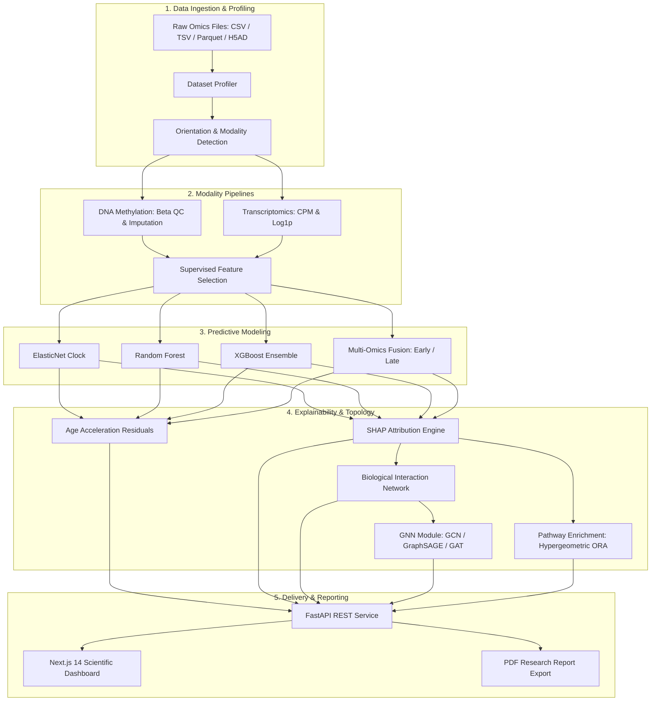

# BioAge-X 🧬⏱️

> **"From molecular signals to biological age."**  
> An explainable multi-omics computational platform that estimates biological age from molecular data and investigates the molecular mechanisms associated with accelerated or decelerated aging.

[](https://github.com/bioage-x/bioage-x/actions)
[](https://www.python.org/)
[](https://opensource.org/licenses/Apache-2.0)
[](https://nextjs.org/)
[](https://fastapi.tiangolo.com/)
[](https://pytorch.org/)

---

## ⚠️ Important Scientific & Educational Disclaimer

**BioAge-X is strictly an educational and academic computational biology research platform.**  
It is **NOT a clinical diagnostic system or medical device**. Biological age acceleration estimates reflect mathematical residuals under specific statistical assumptions and do not constitute clinical diagnosis, personalized disease prognosis, or health advice.

---

## 🌟 Key Capabilities

1. **Multi-Omics Ingestion & Profiling**:
   - Ingests CSV, TSV, Parquet, and H5AD (AnnData) matrices.
   - Automatic orientation inference (`samples_by_features` vs `features_by_samples`).
   - Automated detection of chronological age, sample IDs, duplicate loci, and missingness.
2. **Modality-Specific Preprocessing**:
   - **DNA Methylation**: Beta range verification $[0, 1]$, missingness filter, variance thresholding, CpG whitelist filtering.
   - **Transcriptomics**: Library-size CPM normalization, log1p transformation $\log_2(x + 1)$, variance filtering.
3. **Supervised Feature Selection**:
   - Mutual Information regression against chronological age.
   - Collinearity pruning ($r > 0.95$).
   - Full provenance tracking from raw probe to model weight.
4. **Predictive Biological Age Models**:
   - **ElasticNet** regularized linear regression (Horvath / Hannum epigenetic clock paradigm).
   - **Random Forest** and **XGBoost** tree ensembles capturing non-linear epistasis.
   - **Multi-Omics Fusion**: Early feature concatenation, Late stacking meta-regression, and Weighted ensemble.
5. **Age Acceleration Analysis**:
   - Sample-level residual calculation: $\text{Age Acceleration} = \text{Predicted Bio Age} - \text{Chronological Age}$.
   - Cohort-level stratification (Accelerated, Decelerated, Synchronous).
6. **SHAP Explainability**:
   - Global biomarker ranking by mean absolute SHAP value ($|\phi_i|$).
   - Sample-level beeswarm distributions and individual local waterfall decompositions.
7. **Biological Interaction Networks**:
   - Heterogeneous interactome graph with NetworkX (Gene, Protein, Pathway, Biological Process).
   - Degree centrality, betweenness centrality, PageRank, and Louvain community detection.
   - Full export to interactive Cytoscape.js browser visualization.
8. **Graph Neural Networks (GNNs)**:
   - PyTorch-based GCN, GraphSAGE, and GAT for node-level aging score regression.
9. **Pathway Over-Representation Analysis (ORA)**:
   - Hypergeometric test against curated hallmarks of aging (Senescence, Telomeres, Epigenetics, mTOR, Mitochondria, Inflammaging) with Benjamini-Hochberg FDR correction.
10. **Automated Research Reporting**:
    - Generates downloadable, publication-grade scientific PDF reports and machine-readable JSON summaries with reproducibility fingerprints.

---

## 🏛️ System Architecture



---

## 🚀 Quick Start

### Option A: Docker Compose (Recommended)

Run the full stack (API + Next.js frontend + SQLite database) with a single command:

```bash
docker compose up --build
```

- **Frontend Dashboard**: [http://localhost:3000](http://localhost:3000)
- **FastAPI Documentation**: [http://localhost:8000/docs](http://localhost:8000/docs)
- **Health Check**: [http://localhost:8000/health](http://localhost:8000/health)

### Option B: Local Development

#### 1. Backend Setup (Python 3.10 - 3.12)

```bash
# Clone the repository
git clone https://github.com/bioage-x/bioage-x.git
cd bioage-x

# Install dependencies
pip install -r requirements.txt

# Generate synthetic demo multi-omics cohort
python scripts/generate_demo_data.py

# Start FastAPI backend server
uvicorn apps.api.main:app --host 0.0.0.0 --port 8000 --reload
```

#### 2. Frontend Setup (Node.js 18+)

```bash
cd apps/frontend
npm install
npm run dev
```

Open [http://localhost:3000](http://localhost:3000) in your browser.

---

## 🧪 Running Tests & Benchmarks

Run the complete test suite:

```bash
python -m pytest tests/ -v
```

Execute the full end-to-end benchmark pipeline:

```bash
python scripts/run_benchmark.py
```

---

## 📊 Platform Dashboard Pages

| Route | Functionality |
|:---|:---|
| `/dashboard` | Executive KPIs, model comparisons, lead biomarkers, and recent runs |
| `/datasets` | Multi-omics file upload, orientation detection, and matrix preview table |
| `/analysis` | 12-Step guided workflow wizard and preprocessing parameter controls |
| `/models` | Cross-model benchmarks (MAE, RMSE, R², Pearson, Spearman) and residual scatter |
| `/explainability` | SHAP beeswarm summary plot and local sample waterfall decomposition |
| `/biomarkers` | Filterable directory of prioritized molecular loci and functional annotations |
| `/network` | Cytoscape.js interactive graph with centrality ranking and community clusters |
| `/gnn` | GCN, GraphSAGE, and GAT node regression training and validation |
| `/pathways` | Hypergeometric over-representation analysis against hallmarks of aging |
| `/experiments` | Experiment tracking history with side-by-side run comparison mode |
| `/reports` | Synthesized scientific report viewer and one-click PDF download |
| `/settings` | System diagnostics, engine health checks, and scientific disclaimers |

---

## 📜 Citation

If you use BioAge-X in your academic research or teaching, please cite:

```bibtex
@software{bioage_x_2026,
  author = {BioAge-X Research Collective},
  title = {BioAge-X: Explainable Multi-Omics Biological Age Estimation & Network Biology Platform},
  year = {2026},
  url = {https://github.com/bioage-x/bioage-x},
  version = {0.1.0}
}
```

---

## 📄 License

BioAge-X is licensed under the [Apache 2.0 License](LICENSE).
