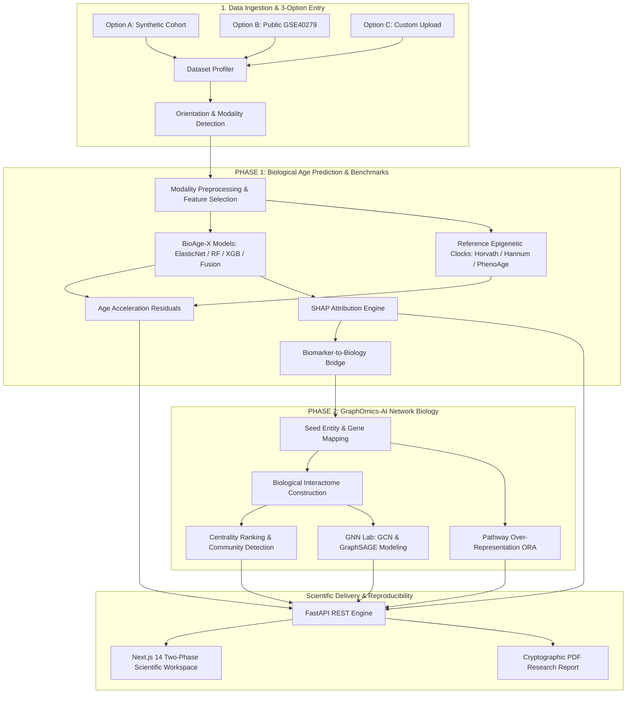

# BioAge-X 🧬⏱️

> **"From molecular signals to biological age."**  
> An explainable multi-omics computational platform that estimates biological age from molecular data and investigates the molecular mechanisms associated with accelerated or decelerated aging.

[](https://github.com/AceAss/BioAge-X/actions)
[](https://www.python.org/)
[](https://opensource.org/licenses/Apache-2.0)
[](https://nextjs.org/)
[](https://fastapi.tiangolo.com/)
[](https://pytorch.org/)

---

## ⚠️ Important Scientific & Educational Disclaimer

**BioAge-X is strictly an educational and academic computational biology research platform.**  
It is **NOT a clinical diagnostic system or medical device**. Biological age acceleration estimates reflect mathematical residuals under specific statistical assumptions and do not constitute clinical diagnosis, personalized disease prognosis, or health advice.

---

---

## 🔬 The Two-Phase Research Framework

BioAge-X is structured around a rigorous, two-phase computational biology framework:

```
          MOLECULAR DATA
                ↓
        ┌───────────────┐
        │    PHASE 1    │
        │    BIOAGE     │
        └───────┬───────┘
                ↓
      Biological Age Estimate
                ↓
        Age Acceleration
                ↓
      Clock Benchmarking (Horvath / Hannum / PhenoAge)
                ↓
              SHAP
                ↓
      Candidate Biomarkers
                ↓
        ┌───────────────┐
        │    PHASE 2    │
        │ GRAPHOMICS-AI │
        └───────┬───────┘
                ↓
      Gene / Protein Mapping
                ↓
       Biological Network
                ↓
      Pathway Association
                ↓
              GNN
                ↓
      Aging Network Signals
```

### Phase 1: Multi-Omics Biological Age Prediction & Benchmarking
1. **Multi-Omics Ingestion & Profiling**:
   - Ingests CSV, TSV, Parquet, and H5AD (AnnData) matrices.
   - Automatic orientation inference (`samples_by_features` vs `features_by_samples`).
   - Automated detection of chronological age, sample IDs, duplicate loci, and missingness.
2. **Modality Preprocessing & Feature Selection**:
   - **DNA Methylation**: Beta range $[0, 1]$ QC, missingness filtering, variance thresholding.
   - **Transcriptomics**: Library-size CPM normalization, $\log_2(\text{CPM} + 1)$ variance-stabilizing transformation.
   - **Supervised Selection**: Mutual Information regression against chronological age and collinearity pruning ($r > 0.95$).
3. **BioAge-X Predictive Modeling**:
   - **ElasticNet** regularized linear regression.
   - **Random Forest** and **XGBoost** tree ensembles capturing non-linear interactions.
   - **Multi-Omics Fusion**: Early feature concatenation, Late stacking meta-regression, and inverse-MAE Weighted Ensemble.
4. **Epigenetic Clock Benchmarking (`/benchmarks`)**:
   - Benchmarks models against canonical biological clocks:
     - **Horvath Pan-Tissue Clock (2013)** (353 CpGs, non-linear anti-log age transformation).
     - **Hannum Whole Blood Clock (2013)** (71 CpGs linear scoring with age intercept).
     - **Levine PhenoAge (2018)** (513 CpGs mortality-associated surrogate biomarkers).
   - **Zero Fabrication Guarantee**: Detects probe coverage; if features are missing, reports unavailability honestly without fabricating data.
5. **Age Acceleration Residuals**:
   - Residual calculation: $\text{Age Acceleration} = \text{Predicted Bio Age} - \text{Chronological Age}$.
   - Cohort stratification into Accelerated ($\Delta > +1.0$ yr), Decelerated ($\Delta < -1.0$ yr), and Synchronous aging.
6. **SHAP Explainability & Biomarker Bridge**:
   - Exact polynomial and analytical SHAP decomposition.
   - **Biomarker-to-Biology Bridge**: Transforms top predictive features into prioritized **Candidate Aging-Associated Features** mapped to target genes, UniProt proteins, and chromosomes.

### Phase 2: GraphOmics-AI Network Biology & GNNs
1. **Biological Interaction Networks**:
   - Heterogeneous interactome graph with NetworkX (Gene, Protein, Pathway).
   - Topological metrics: Degree centrality, betweenness centrality, PageRank, and Louvain community detection.
   - Interactive Cytoscape.js canvas with node inspection and cluster filtering.
2. **Top Aging Network Nodes**:
   - Ranked topological identification of hub genes and bottleneck regulators.
3. **Functional Pathway Enrichment (ORA)**:
   - Hypergeometric test against hallmarks of aging (Senescence, Telomeres, Epigenetics, mTOR, Mitochondria, Inflammaging) with Benjamini-Hochberg FDR correction.
4. **Graph Neural Networks (GNN Lab)**:
   - PyTorch-based **GCN** (spectral convolution) and **GraphSAGE** (inductive neighborhood aggregation) modeling network-level aging signals.
   - Outputs explicitly designated as **computational predictions**.
5. **Two-Phase Publication Reporting**:
   - Generates publication-grade research reports in JSON and cryptographic PDF formats stamped with SHA-256 reproducibility hashes.

---

## 📥 Three Ways to Begin an Analysis

BioAge-X provides three standardized entry paths feeding into the identical two-phase research pipeline:

- **Option A — Synthetic Demo Cohort**: Load the pre-configured 150-sample multi-omics cohort with 120 CpGs and 150 transcriptomic features.
- **Option B — Curated Public Benchmark**: Load real public whole-blood methylation benchmark data (**GSE40279 / Hannum 2013**, 80 samples, 71 canonical CpGs) with verified clinical covariates.
- **Option C — Custom Multi-Omics Upload**: Upload custom CSV/TSV/Parquet/H5AD matrices in either sample-major or probe-major orientation.

---

## 🏛️ System Architecture



---

## 🚀 Quick Start

### Option A: Docker Compose (Recommended)

Run the full stack (API + Next.js frontend + SQLite database) with a single command:

```bash
docker compose up --build
```

- **Frontend Dashboard**: [http://localhost:3000](http://localhost:3000)
- **FastAPI Documentation**: [http://localhost:8000/docs](http://localhost:8000/docs)
- **Health Check**: [http://localhost:8000/health](http://localhost:8000/health)

### Option B: Local Development

#### 1. Backend Setup (Python 3.10 - 3.12)

```bash
# Clone the repository
git clone https://github.com/AceAss/BioAge-X.git
cd bioage-x

# Install dependencies
pip install -r requirements.txt

# Generate synthetic demo multi-omics cohort and public benchmark
python scripts/generate_demo_data.py
python scripts/create_public_benchmarks.py

# Start FastAPI backend server
uvicorn apps.api.main:app --host 0.0.0.0 --port 8000 --reload
```

#### 2. Frontend Setup (Node.js 18+)

```bash
cd apps/frontend
npm install
npm run dev
```

Open [http://localhost:3000](http://localhost:3000) in your browser.

---

## 🧪 Running Tests & Benchmarks

Run the complete test suite:

```bash
python -m pytest tests/ -v
```

Execute the full end-to-end two-phase benchmark pipeline:

```bash
python scripts/run_benchmark.py
```

---

## 📊 Platform Research Workspace Navigation

| Route | Scientific Purpose |
|:---|:---|
| `/dashboard` | Two-Phase executive research overview, hypothesis cards, and KPI metrics |
| `/datasets` | 3-Option data entry (Demo, GSE40279 Public, Custom Upload) and matrix profiling |
| `/benchmarks` | Direct comparison against established epigenetic clocks (Horvath, Hannum, PhenoAge) |
| `/analysis` | 12-Step reproducible research workflow wizard and pipeline configuration |
| `/models` | Cross-model evaluation (MAE, RMSE, R², Pearson r, Spearman $\rho$) |
| `/explainability` | SHAP beeswarm global attributions and sample-level waterfall decompositions |
| `/biomarkers` | Candidate Aging-Associated Biomarkers directory and "Continue to GraphOmics-AI" bridge |
| `/network` | Interactive Cytoscape.js interactome with Top Aging Network Nodes table |
| `/gnn` | GCN and GraphSAGE node-level aging score regression lab |
| `/pathways` | Hypergeometric over-representation analysis against hallmarks of aging |
| `/experiments` | Experiment tracking history with SHA-256 reproducibility hashes |
| `/reports` | Two-Phase scientific report viewer and one-click PDF export |
| `/settings` | System diagnostics, engine health checks, and scientific nomenclature disclaimers |

---

## 📜 Citation

If you use BioAge-X in your academic research or teaching, please cite:

```bibtex
@software{bioage_x_2026,
  author = {BioAge-X Research Collective},
  title = {BioAge-X: Explainable Multi-Omics Biological Age Estimation & Network Biology Platform},
  year = {2026},
  url = {https://github.com/AceAss/BioAge-X},
  version = {0.1.0}
}
```

---

## 📄 License

BioAge-X is licensed under the [Apache 2.0 License](LICENSE).

